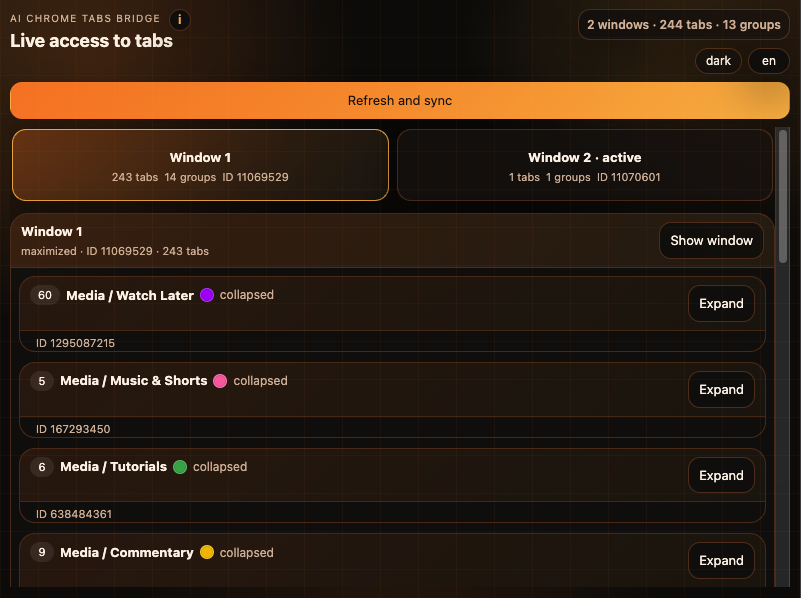

# AI Chrome Tabs Bridge

AI Chrome Tabs Bridge is a Chrome extension plus a small local Python bridge for reading live Chrome windows, tabs, and tab groups, then sending tab-management commands back to the browser.

## What it does

- reads the current Chrome window/tab/group state;
- shows that state in a popup UI;
- lets you activate tabs, focus windows, move tabs, and manage groups;
- keeps runtime state outside the repository by default.

## Preview



## Installation

You can install and use this project in two ways.

### Option 1: Let Codex set it up

If you are using Codex, install the skill named `chrome-tabs-bridge` first.

What that means:

1. The skill file is called `SKILL.md`.
2. Codex stores installed skills in its own skills folder.
3. The repo copy of `SKILL.md` is only a reference file. The installed skill is the one Codex loads from its skills folder.

Then open a fresh Codex chat and say:

```text
Use skill chrome-tabs-bridge.
Clone the repo, load the Chrome extension, start the bridge, and help me manage tabs.
```

Codex will then:

1. clone the GitHub repository,
2. load the unpacked Chrome extension,
3. start the local Python bridge,
4. and guide you through `Refresh and sync`.

This is the easiest option if you want the AI agent to handle the setup for you.

### Option 2: Install it manually from GitHub

Clone the repository:

```bash
git clone https://github.com/antonzaratustra/ai-chrome-tabs-bridge.git
```

Then:

1. Open Chrome and load the extension:
   - `chrome://extensions`
   - enable `Developer mode`
   - click `Load unpacked`
   - choose the repository folder
2. Start the local bridge:

```bash
python3 bridge.py
```

3. Open the popup and click `Refresh and sync`.

By default the bridge stores its data in `~/.chrome-tabs-bridge`. You can override that with `--root` if you want a different location.

## Requirements

- Google Chrome
- Python 3.13+ or any recent Python 3.x with the standard library
- `gh` if you want to publish or manage the repository through GitHub CLI

No third-party Python packages are required.

## Repository layout

- `manifest.json` - Chrome extension manifest
- `background.js` - bridge sync and command handling
- `popup.html`, `popup.css`, `popup.js` - extension UI
- `bridge.py` - local HTTP bridge
- `offscreen.html`, `offscreen.js` - extension support files
- `SKILL.md` - repository-local guide for AI agents and contributors

Runtime files such as `state.json`, `queue.json`, and `results.jsonl` are ignored by Git.

## Quick start

If you already installed the repository, load the extension in Chrome, start
the bridge, and click `Refresh and sync` in the popup.

## Check that everything is running

```bash
curl http://127.0.0.1:8765/health
curl http://127.0.0.1:8765/state
```

## Working with the popup

- `Refresh and sync` asks Chrome for the latest state and updates the bridge.
- The top row lets you switch between Chrome windows.
- Clicking a tab activates it in Chrome.
- Group headers can be collapsed or expanded.
- The `i` icon in the header shows a short localized usage tip.

## For AI agents

This repository includes [`SKILL.md`](SKILL.md), a short repository-local guide that explains what the project is for and how an AI agent should use the live bridge. The active Codex skill still lives in the user's Codex skills folder, but this repo file is the human-readable copy that travels with the codebase.

## Command API

The bridge listens on `http://127.0.0.1:8765` and accepts:

- `GET /health`
- `GET /state`
- `POST /state`
- `POST /command`
- `POST /result`
- `POST /clear`

## Publishing

If you want to publish this repository to GitHub:

1. Remove any runtime state from the working tree if needed.
2. Commit the extension and bridge code.
3. Push the branch.
4. Open a draft PR or publish the default branch, depending on your workflow.

## Security note

Do not commit live browser state, personal session data, or any local debugging outputs. The ignored runtime files are meant only for local use.
